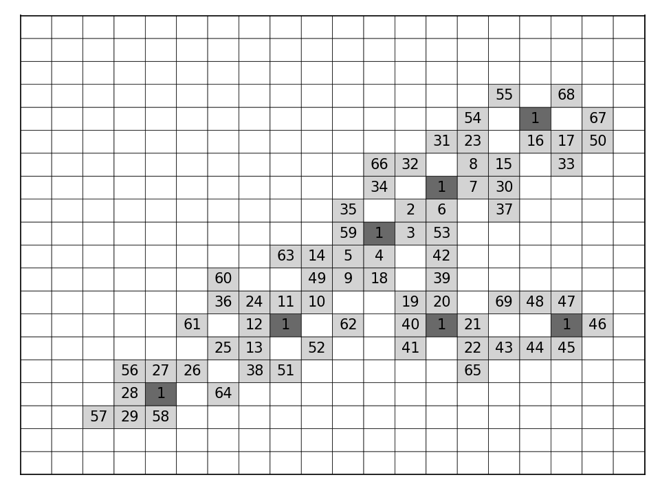

## About
This is small educational project on C++ for computing high scores in stepping stone puzzle (OEIS-A337663).
> Start with an infinite square grid. Each cell has eight neighbors. Place n 1's anywhere. Now place the numbers 2, 3, ..., m in order, subject to the rule that when you place k, the sum of its neighbors must equal k. Then a(n) is the maximum m that can be achieved.

Computed results give better lower bound for n=7 (on 07/05/2022).

Main program processes problem *instances*, combinations of 1's on square NxN grid. For every combination program finds best puzzle solution according to the rules.

## Requirements
g++, OpenMP

## Usage
- Compile code with **make**
- Run:
```sh
 dfs_search /path_to_file label_string
```   

## Input file format
- line 1:
  integer K: number of problem instances
  > K
- lines: 2 ... K+1:   
K lines with M pairs of integers: 1's coordinates
   > x1 y1 x2 y2 x3 y3 ...

## How to obtain high scores
When M < 7 it is possible to check every 1's combination.
After M=7 it is not possible to do in reasonable time on laptop.
It turned out that greedy approach works fine in practice.
One can use precomputed database of results for M-k sorted by score and then check solutions for the rest k positions.

## Search space
In experiments for practical purposes **search space was truncated** by following heuristic rule:
let r(m) be the minimal distance between m-th one to the rest in combination.
Then only combinations with **3 <= r(m) <= 5** (for every except first two 1's) are considered for check.

## Records
#### M=7, score=67
```
 .  .  .  .  .  .  .  .  .  .  .  .  .  .  .  .  .  .  .  .
 .  .  .  .  .  .  .  .  .  .  .  .  .  .  .  .  .  .  .  .
 .  .  .  .  .  .  .  .  .  .  .  .  .  .  .  .  .  .  .  .
 .  .  .  .  .  .  .  .  .  .  .  .  .  .  .  .  .  .  .  .
 .  .  .  .  .  .  45 .  57 56 37 .  .  .  .  .  .  .  .  .
 .  .  .  .  .  .  44  1 .  .  19 18 36 53 .  .  .  .  .  .
 .  .  .  .  .  .  43 .  52 51 .   1 17 .  .  .  .  .  .  .
 .  .  .  59 30 .  42 .  .  .  32 16 .  64 .  .  .  .  .  .
 .  .  .  .  29  1 .  41 65 .  15 .  .  .  47 .  25 49 .  .
 .  .  .  .  58 28 27 .  14 10  5 63 .  .  46  1 24 .  .  .
 .  .  .  .  .  .  .  26 .   4  1 31 11 .  22 23 48 .  .  .
 .  .  .  .  .  .  .  38 12  8  3  2  9 21 66 .  .  .  .  .
 .  .  .  .  .  .  .  50 .  .  39  6  1 .  .  .  .  .  .  .
 .  .  .  .  .  .  .  .  .  .  13  7 54 55 .  .  .  .  .  .
 .  .  .  .  .  .  .  .  67 33 20 40 .  .  .  .  .  .  .  .
 .  .  .  .  .  .  .  .  34 .  .  60 .  .  .  .  .  .  .  .
 .  .  .  .  .  .  .  .  35  1 61 .  .  .  .  .  .  .  .  .
 .  .  .  .  .  .  .  .  .  .  62 .  .  .  .  .  .  .  .  .
 .  .  .  .  .  .  .  .  .  .  .  .  .  .  .  .  .  .  .  .
 .  .  .  .  .  .  .  .  .  .  .  .  .  .  .  .  .  .  .  .
```
#### M=7, score=68
```
.  .  .  .  .  .  .  .  .  .  .  .  .  .  .  .  .  .  .  .
.  .  .  .  .  .  .  .  .  .  .  .  .  .  .  .  .  .  .  .
.  57 29 58 .  .  .  .  .  .  .  .  .  .  .  48 47 .  .  .
.  .  28  1 .  64 .  .  .  .  .  .  .  .  .  .   1 46 .  .
.  .  56 27 26 .  38 51 .  .  .  .  .  65 .  44 45 .  .  .
.  .  .  .  .  25 13 .  52 .  .  41 .  22 43 .  .  .  .  .
.  .  .  .  61 .  12  1 .  62 .  40  1 21 .  .  .  .  .  .
.  .  .  .  .  36 24 11 10 .  .  19 20 .  .  .  .  .  .  .
.  .  .  .  .  60 .  .  49  9 18 .  39 .  .  .  .  .  .  .
.  .  .  .  .  .  .  63 14  5  4 .  42 .  .  .  .  .  .  .
.  .  .  .  .  .  .  .  .  59  1  3 53 .  .  .  .  .  .  .
.  .  .  .  .  .  .  .  .  35 .   2  6 .  37 .  .  .  .  .
.  .  .  .  .  .  .  .  .  .  34 .   1  7 30 .  .  .  .  .
.  .  .  .  .  .  .  .  .  .  66 32 .   8 15 .  33 .  .  .
.  .  .  .  .  .  .  .  .  .  .  .  31 23 .  16 17 50 .  .
.  .  .  .  .  .  .  .  .  .  .  .  .  54 .   1 .  67 .  .
.  .  .  .  .  .  .  .  .  .  .  .  .  .  55 .  68 .  .  .
.  .  .  .  .  .  .  .  .  .  .  .  .  .  .  .  .  .  .  .
.  .  .  .  .  .  .  .  .  .  .  .  .  .  .  .  .  .  .  .
.  .  .  .  .  .  .  .  .  .  .  .  .  .  .  .  .  .  .  .
```
Notice typical substructure in solution, "bridge".
```
X  X .
.  1 X
X  X .
```
This also can be used in building heuristic method.
For example, during the computation for M=K-1 every solution can be checked
if it can be continued with this substructure like

```
v-1, v, bridge:[v+1, v+2, v+3, v+4, v+5], v+6, v+7, v+8
```

```
 .  .  .  .  .  .  .  .  .  .  .  .  .  .  .  .  .  .  .  .
 .  .  .  .  .  .  .  .  .  .  .  .  .  .  .  .  .  .  .  .
 .  57 29 58 .  .  .  .  .  .  .  .  .  .  .  .  .  .  .  .
 .  .  28  1 .  64 .  .  .  .  .  .  .  .  .  48 47 .  .  .
 .  .  56 27 26 .  38 51 .  .  .  .  .  65 .  .   1 46 .  .
 .  .  .  .  .  25 13 .  52 .  .  41 .  22 43 44 45 .  .  .
 .  .  .  .  61 .  12  1 .  62 .  40  1 21 .  .  .  .  .  .
 .  .  .  .  .  36 24 11 10 .  .  19 20 .  .  .  .  .  .  .
 .  .  .  .  .  60 .  .  49  9 18 .  39 .  .  .  .  .  .  .
 .  .  .  .  .  .  .  63 14  5  4 .  42 .  .  .  .  .  .  .
 .  .  .  .  .  .  .  .  .  59  1  3 53 .  .  .  .  .  .  .
 .  .  .  .  .  .  .  .  .  35 .   2  6 .  37 .  .  .  .  .
 .  .  .  .  .  .  .  .  .  .  34 .   1  7 30 .  .  .  .  .
 .  .  .  .  .  .  .  .  .  .  66 32 .   8 15 .  33 .  .  .
 .  .  .  .  .  .  .  .  .  .  .  .  31 23 .  16 17 50 .  .
 .  .  .  .  .  .  .  .  .  .  .  .  .  54 .   1 .  67 .  .
 .  .  .  .  .  .  .  .  .  .  .  .  .  .  55 .  68 .  .  .
 .  .  .  .  .  .  .  .  .  .  .  .  .  .  .  .  .  .  .  .
 .  .  .  .  .  .  .  .  .  .  .  .  .  .  .  .  .  .  .  .
 .  .  .  .  .  .  .  .  .  .  .  .  .  .  .  .  .  .  .  .

 .  .  .  .  .  .  .  .  .  .  .  .  .  .  .  .  .  .  .  .
 .  .  .  .  .  .  .  .  .  .  .  .  .  .  .  .  .  .  .  .
 .  57 29 58 .  .  .  .  .  .  .  .  .  .  .  .  .  .  .  .
 .  .  28  1 .  64 .  .  .  .  .  .  .  .  .  .  .  .  .  .
 .  .  56 27 26 .  38 51 .  .  .  .  .  .  65 .  .  .  .  .
 .  .  .  .  .  25 13 .  52 .  .  41 .  22 43 .  .  .  .  .
 .  .  .  .  61 .  12  1 .  62 .  40  1 21 .  44 .  48 .  .
 .  .  .  .  .  36 24 11 10 .  .  19 20 .  .  45  1 47 .  .
 .  .  .  .  .  60 .  .  49  9 18 .  39 .  .  .  46 .  .  .
 .  .  .  .  .  .  .  63 14  5  4 .  42 .  .  .  .  .  .  .
 .  .  .  .  .  .  .  .  .  59  1  3 53 .  .  .  .  .  .  .
 .  .  .  .  .  .  .  .  .  35 .   2  6 .  37 .  .  .  .  .
 .  .  .  .  .  .  .  .  .  .  34 .   1  7 30 .  .  .  .  .
 .  .  .  .  .  .  .  .  .  .  66 32 .   8 15 .  33 .  .  .
 .  .  .  .  .  .  .  .  .  .  .  .  31 23 .  16 17 50 .  .
 .  .  .  .  .  .  .  .  .  .  .  .  .  54 .   1 .  67 .  .
 .  .  .  .  .  .  .  .  .  .  .  .  .  .  55 .  68 .  .  .
 .  .  .  .  .  .  .  .  .  .  .  .  .  .  .  .  .  .  .  .
 .  .  .  .  .  .  .  .  .  .  .  .  .  .  .  .  .  .  .  .
 .  .  .  .  .  .  .  .  .  .  .  .  .  .  .  .  .  .  .  .
```
#### M=7, score=69
 ```
 .  .  .  .  .  .  .  .  .  .  .  .  .  .  .  .  .  .  .  .
 .  .  .  .  .  .  .  .  .  .  .  .  .  .  .  .  .  .  .  .
 .  57 29 58 .  .  .  .  .  .  .  .  .  .  .  .  .  .  .  .
 .  .  28  1 .  64 .  .  .  .  .  .  .  .  .  .  .  .  .  .
 .  .  56 27 26 .  38 51 .  .  .  .  .  65 .  .  .  .  .  .
 .  .  .  .  .  25 13 .  52 .  .  41 .  22 43 44 45 .  .  .
 .  .  .  .  61 .  12  1 .  62 .  40  1 21 .  .   1 46 .  .
 .  .  .  .  .  36 24 11 10 .  .  19 20 .  69 48 47 .  .  .
 .  .  .  .  .  60 .  .  49  9 18 .  39 .  .  .  .  .  .  .
 .  .  .  .  .  .  .  63 14  5  4 .  42 .  .  .  .  .  .  .
 .  .  .  .  .  .  .  .  .  59  1  3 53 .  .  .  .  .  .  .
 .  .  .  .  .  .  .  .  .  35 .   2  6 .  37 .  .  .  .  .
 .  .  .  .  .  .  .  .  .  .  34 .   1  7 30 .  .  .  .  .
 .  .  .  .  .  .  .  .  .  .  66 32 .   8 15 .  33 .  .  .
 .  .  .  .  .  .  .  .  .  .  .  .  31 23 .  16 17 50 .  .
 .  .  .  .  .  .  .  .  .  .  .  .  .  54 .   1 .  67 .  .
 .  .  .  .  .  .  .  .  .  .  .  .  .  .  55 .  68 .  .  .
 .  .  .  .  .  .  .  .  .  .  .  .  .  .  .  .  .  .  .  .
 .  .  .  .  .  .  .  .  .  .  .  .  .  .  .  .  .  .  .  .
 .  .  .  .  .  .  .  .  .  .  .  .  .  .  .  .  .  .  .  .
```
